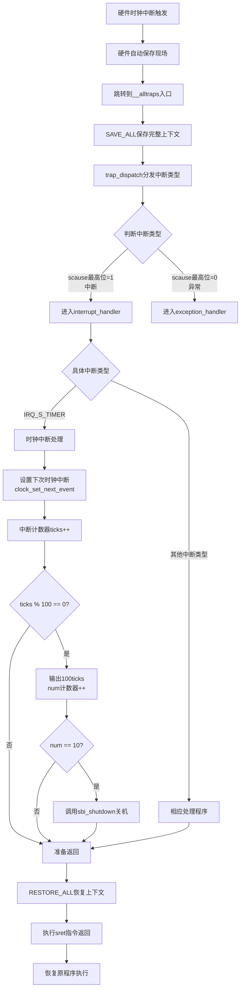
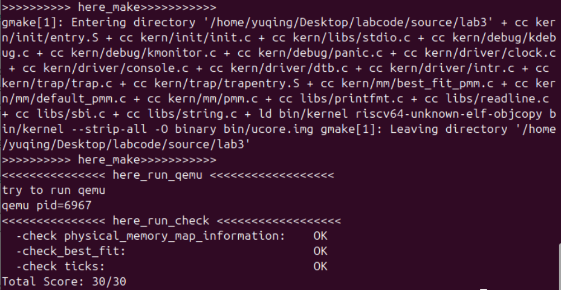
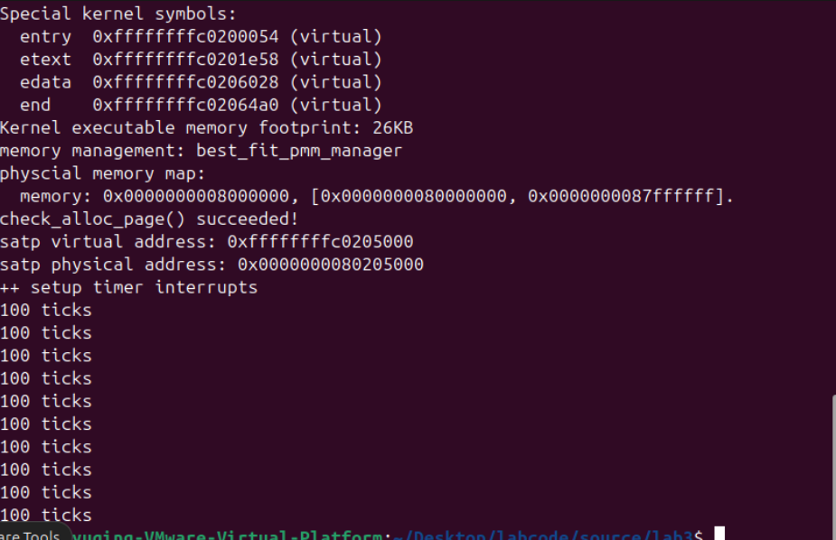

<h1 align="center" style="font-size: 44px"> 实验三：中断与中断处理流程 </h1>

**小组成员：**

- 管一凡：2312307
- 周雨晴：2312313
- 欧一凡：2312826

**Github仓库地址：**https://github.com/Yifan-Guan/NKU_OS_2025_lab3.git

**说明：**

# 练习1：完善中断处理

## 1.实现过程

结合实验指导书内容依次完成下列功能：

- 设置下次时钟中断
  - 使用clock_set_next_event()函数
  - 原因：OpenSBI提供的接口一次只能设置一个时钟中断事件。所以我们采用的方式是：一开始只设置一个时钟中断，之后每次发生时钟中断的时候，设置下一次的时钟中断。
- 维护中断计数器
  - 每次中断，计数器ticks加一
- 定期输出提示信息
  - 每当计数器ticks达到100（TICK_NUM）时，打印一次提示信息
- 控制程序运行时间后自动关机
  - 在设定时间（10次打印或者说10s）到达后，通过关机函数sbi_shutdown()强制关机
  - 这里需要补充一个变量num，用来记录打印次数

## 2.定时器中断处理的流程



## 3.结果呈现

### 3.1 通过make grade验证



### 3.2 通过qemu验证

每秒打印一次“100 ticks”，打印10次后强制关机



# Challenge1：描述与理解中断流程
## 1. 异常产生阶段
ucore 中处理中断异常的完整流程
• CPU 检测到异常或中断事件

• 将当前 PC 值保存到 sepc 寄存器

• 将异常原因保存到 scause 寄存器

• 将相关异常信息保存到 stval 寄存器（如缺页地址、非法指令等）

• 保存当前状态到 sstatus 寄存器

• 关闭中断（清除 sstatus.SIE 位）

• 跳转到 stvec 寄存器指向的异常处理入口地址

mv a0, sp 的目的:
mv a0, sp  # 将栈指针 sp 的值移动到 a0 寄存器
目的： 将当前栈指针（指向已保存的 trapframe 结构）作为参数传递给 trap 函数。

## 2.SAVE_ALL 中寄存器保存在栈中的位置确定:

栈布局由 struct trapframe 定义决定：
struct trapframe {
    struct pushregs gpr;    // 36个通用寄存器，偏移量 0-35*REGBYTES
    uintptr_t status;       // 状态寄存器，偏移量 36*REGBYTES
    uintptr_t epc;          // 异常程序计数器，偏移量 37*REGBYTES  
    uintptr_t badvaddr;     // 错误地址，偏移量 38*REGBYTES
    uintptr_t cause;        // 异常原因，偏移量 39*REGBYTES
};

SAVE_ALL 宏的具体实现：
.macro SAVE_ALL
    # 保存通用寄存器到栈中预定位置
    sd x0, 0*REGBYTES(sp)   # zero 寄存器
    sd x1, 1*REGBYTES(sp)   # ra 寄存器
    sd x2, 2*REGBYTES(sp)   # sp 寄存器
    # ... 保存其他寄存器
    sd x31, 31*REGBYTES(sp) # t6 寄存器
    
    # 保存特殊寄存器
    csrr t0, sstatus
    sd t0, 36*REGBYTES(sp)  # status
    csrr t0, sepc
    sd t0, 37*REGBYTES(sp)  # epc
    csrr t0, stval
    sd t0, 38*REGBYTES(sp)  # badvaddr
    csrr t0, scause
    sd t0, 39*REGBYTES(sp)  # cause
.endm

• 每个寄存器在栈中的偏移量由 struct trapframe 的内存布局决定

• 编译器根据结构体成员的声明顺序和大小计算偏移量

• REGBYTES 是寄存器大小（8字节）

## 3. 对于任何中断，__alltraps 中都需要保存所有寄存器吗？
需要保存所有寄存器，理由如下：

### 1. 上下文完整性要求
   • 异常可能发生在任何代码位置，无法预知哪些寄存器被使用

   • 必须保证异常返回后程序能继续正确执行

   • 只有保存完整的上下文才能实现透明的异常处理

### 2. 通用性设计
   • 使用统一的异常处理入口简化设计

   • 避免为不同类型异常编写不同的保存/恢复代码

   • 符合"总是为最坏情况做准备"的原则

### 3. 嵌套异常处理
   • 在异常处理过程中可能发生新的异常

   • 完整的寄存器保存支持嵌套异常处理

   • 每个异常级别都有独立的上下文保存

### 4. 调试和支持需求
   • 完整的寄存器信息便于调试和核心转储

   • 支持高级功能如单步调试、检查点等

### 5. 性能考虑
   • 寄存器保存/恢复操作相对较快

   • 异常本身是低频事件，性能开销可接受

   • 统一处理比条件保存更简单高效

例外情况：
某些优化场景下（如某些嵌入式系统），如果能够确定某些寄存器不会被修改，可以只保存部分寄存器。但 ucore 作为教学操作系统，选择最安全完整的方案。


# Challenge2：理解上下文切换机制

## 1.汇编代码操作分析

### 1.1 汇编代码实现的功能

```assembly
csrw  sscratch, sp       //将当前sp值保存到sscratch寄存器
csrrw s0, sscratch, x0   //将sscratch值读到s0，同时将x0(0)写入sscratch
```

### 1.2 汇编代码的目的

- csrw  sscratch, sp ：保存原先的栈顶指针到sscratch，用于后面中断处理后的恢复。
- csrrw s0, sscratch, x0 ：将暂存的原栈顶指针保存到s0，同时设置sscratch使其符合设定。

## 2.CSR的保存与还原分析

- 这四个CSR分为两类：状态寄存器（sstatus、sepc）和原因寄存器（scause、stval）
  - 其中状态寄存器是需要恢复的，而原因寄存器不需要恢复。
  - sstatus控制处理器的行为，如果不恢复，会导致系统行为出现异常差错；sstatus还控制特权级的切换，如果不恢复，系统可能卡在某一模式下。
  - sepc控制返回地址，如果不进行恢复，可能导致返回错误的地址、重复执行指令等问题。
  - scause和stval只是记录中断/异常发生的原因和附加信息，只是描述“发生了什么事”，只是起到“记录、描述”的作用，不恢复并不会出现问题。

- store的意义
  - 传递信息：硬件检测到异常/中断，原因寄存器记录相关信息，通过原因寄存器告知软件发生了什么
  - 处理依据：根据这些寄存器保存的信息来决定中断/异常处理策略

# Challenge3：完善异常中断


# 相关知识点
